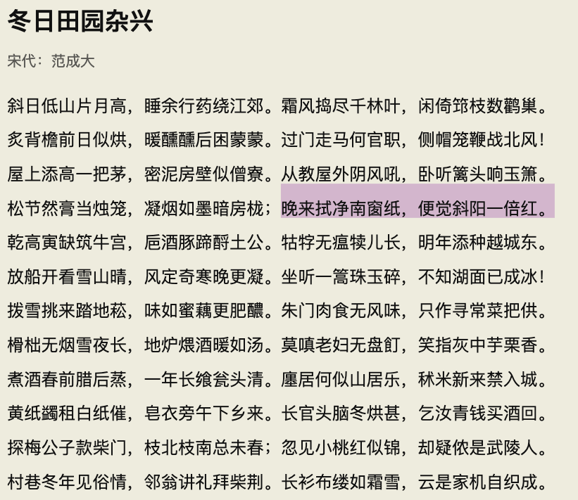

cmcrc-docs readme
#################

Hello! This is a readme file for cmcrc-docs repo.

test1

To add your documents into this repo, you need to firstly check if a corresponding directory is created, you need to manually create if there is no such a directory.

Please carefully check the syntax of your .rst file in your local environment before pushing it to bitbucket, you can check it by:
sudo -H pip install rstcheck

::

    rstcheck <filename>.rst \
    	--report warning \\ |IMG1|\ 

    	--ignore-directives http:post,http:get,http:delete,http:post \
    	--ignore-roles http:post,http:get,http:delete,http:post,http:statuscode

.. bottom of content

